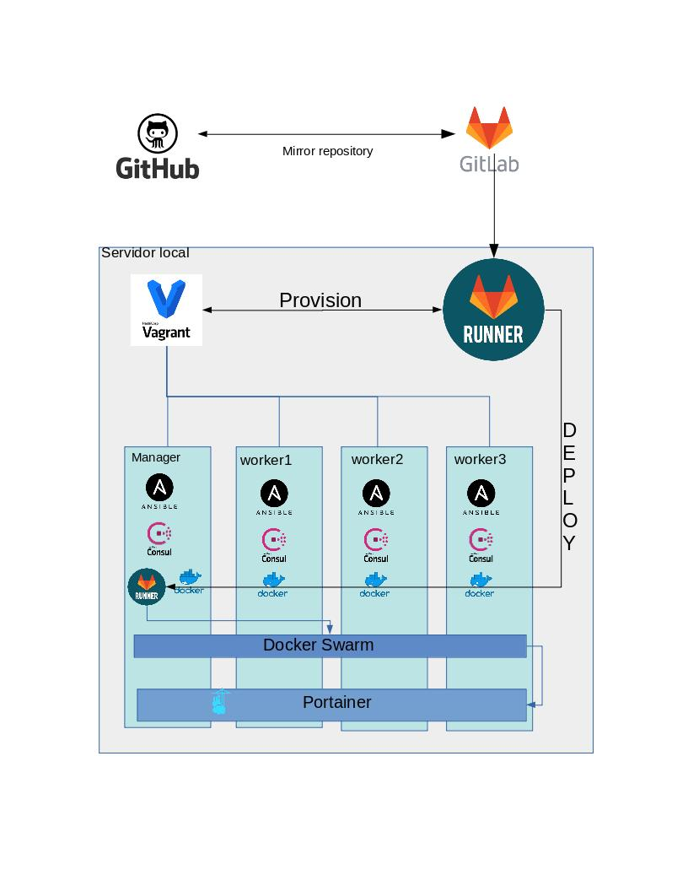

Provisionamiento vagrant con docker y CICD
=========================================

Este desarrollo personal permite usar Infraestructura como codigo, desplegando con Vagrant, luego se configura todo con ansible, se instala docker, se crea un cluster docker-swarm, y luego se despliega de forma automatica la aplicación portainer.

## Prerequisitos / Requerimientos

- [Virtualbox platform](https://www.virtualbox.org/wiki/Downloads)
- [Vagrant](https://docs.vagrantup.com/v2/installation/)
- [Git](https://git-scm.com/)
- [Ansible](http://docs.ansible.com/ansible/intro_installation.html)

## Diagrama de componentes

## Como se compone

Se utiliza centos7 por ser un SO bastante estable y compatible con las herramientas usadas en este proyecto.
Ansible por ser una herramienta de facil uso y aprendizaje. Se crearon diferentes roles para la instalación de cada componente.
Vagrant, Se solicitó que fuera así.
Consul, queria incorporar una capa de auto descubrimiento de servicios, ademas nos provee un alamacen de datos y poder compartirlo con cada uno de los nodos dentro del cluster, como por ejemplo el token del swarm.
Docker, Se solicitó que fuera con docker, es una herramienta muy estable y que permite hacer muchas cosas. Utilice docker-swarm para poder deployar dentro de todas las VM con un archivo unico, administrado por swarm.
En el diagrama se puede ver como interactua cada capa.

## Como ejecutar

	$ git clone https://github.com/cesmoraga/vagrant-ansible-test.git
  
Modificar Vagrantfile, deacuerdo a las VM que necesites (worker), y luego hacer push a master, con esto se subiran los cambios a github, luego se sincronizaran los cambios a [gitlab](https://gitlab.com/camoraga/vagrant-ansible-test/), cuando gitlab detecta el nuevo cambio, ejecuta los pasos de .gitlab-ci.yml en el runner donde esta instalado el vagrant. 

## Restricciones

Cada vez que se ejecuta el CICD, se borra todo lo realizado y se crea nuevamente desde 0. Por ser una prueba de como funciona cada componente y sus integraciones, decidi eliminar todo cada vez que se ejecuta.

## Licence

[GNU GENERAL PUBLIC LICENSE](https://github.com/skecskes/vagrant-centos7-ansible-lamp/blob/master/LICENSE)

